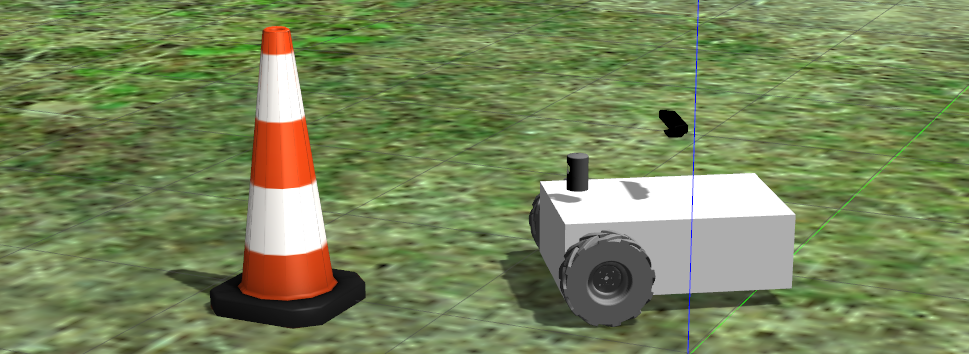

# bowser_sim: Simulation Resources for Bowser

ROS package for Bowser. Includes Gazebo simulation resources, models, plugins, launch files, and other utilities for developing software for the bot. 



### Installation:

1. Make sure you have ROS installed (Melodic or Noetic, depending on Ubuntu version) 
	1. [Ubuntu 18.04 / ROS Melodic](http://wiki.ros.org/melodic/Installation/Ubuntu)
    1. [Ubuntu 20.04 / ROS Noetic](http://wiki.ros.org/noetic/Installation/Ubuntu)
1. Clone this repository to **/home/**: `git clone https://github.com/RoboticsClubatUCF/Bowser.git`
1. Run the simulation setup file to install dependencies and set up environment variables and resource paths:  
	` cd ~/Bowser/catkin_ws/src/bowser_sim `  
	` chmod +x sim_setup.sh `  
	` ./sim_setup.sh `  

### Usage:
bowser_sim can be launched with roslaunch: ``` roslaunch bowser_sim [sim/rviz/etc.].launch ```


